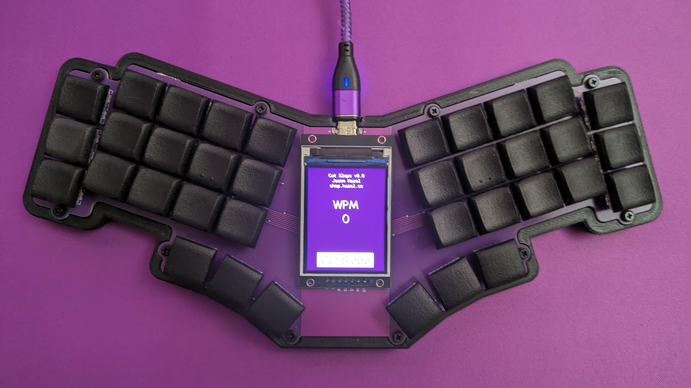

# Cut Slope

_I'm bad at pictures_

## Features
* Integrated RP2040.
* 36 key, choc-spaced, hotswap
* Ortho-ish with dropped/splayed pinkies and fanned thumbs
* Big ass screen support

## Build Guide
* Flash [Firmware](FIRMWARE.md)
* Test matrix with metal tweezers
* Install Hotswap Sockets
* Install Screen
* Done

## Credits
* [Hardware design with RP2040](https://datasheets.raspberrypi.com/rp2040/hardware-design-with-rp2040.pdf)
* [Sleepdealr's RP2040 Design Guide](https://github.com/Sleepdealr/RP2040-designguide)
* [eblastler's ZMK Design Guide](https://github.com/ebastler/zmk-designguide) - Got the SRV05-4 from here
* [Mabroum](https://github.com/AlaaSaadAbdo) - for screen suggestion and moral support
* [Sadek Baroudi](https://github.com/sadekbaroudi) - moral support
* [The Glitch Mob](https://www.youtube.com/watch?v=HD7XAOhkd-w) - for the name
